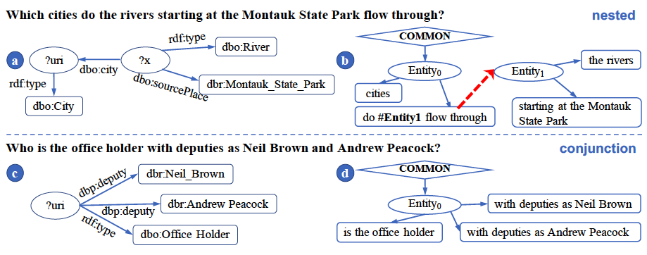
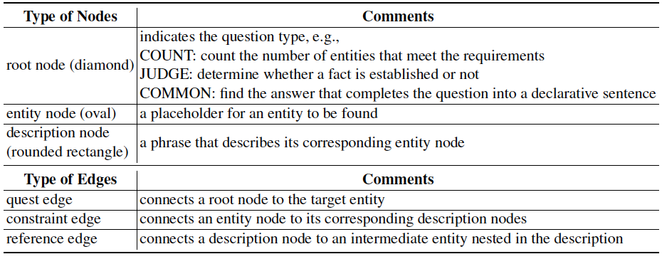
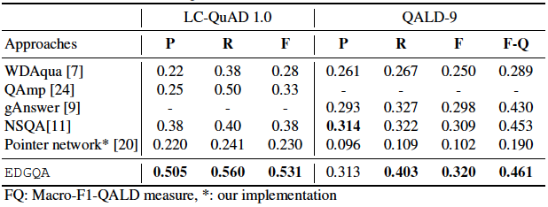

## What is EDGQA?

EDGQA is a QA system over knowledge bases based on Entity-Description Graphs (EDGs). Currently EDGQA has been implemented for DBpedia, tested on LC-QuAD 1.0 and QALD-9.



The above figure shows SPARQL (a. and c.) and EDG (b. and d.) on two exemplar natural language questions. The dashed line connects a description to an intermediate entity. The types of nodes and edges of EDG is defined as follows.



By generating such EDGs, questions are represented as a combination of entities and their description, providing a structure for understanding and answering complex questions. More information are detailed in our paper.

## Downloads

- [GitHub repo release](https://github.com/HXX97/EDGQA/releases)
- [v0.1.1 source code(zip)](https://github.com/HXX97/EDGQA/archive/refs/tags/0.1.1.zip)
- [v0.1.1 source code (tar.gz)](https://github.com/HXX97/EDGQA/archive/refs/tags/0.1.1.tar.gz)

For any questions, feel free to [launch an issue](https://github.com/HXX97/EDGQA/issues) on GitHub or send an e-mail.

## Experiments

QA performance on LC-QuAD 1.0 and QALD 9.



## Citations

```latex
TBD
```

*Last update: 2021/07*
